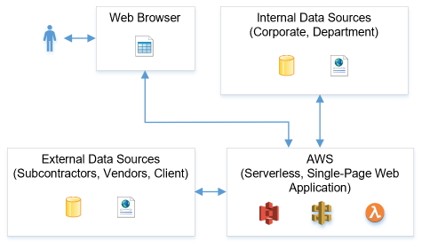
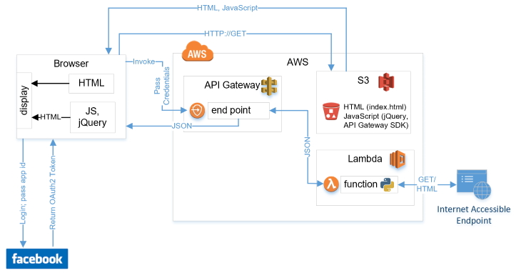
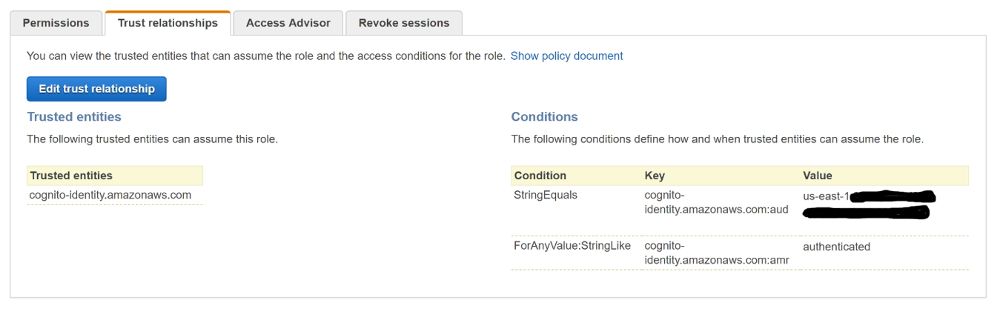
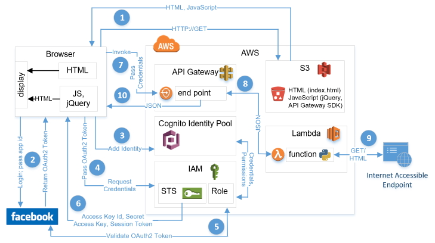
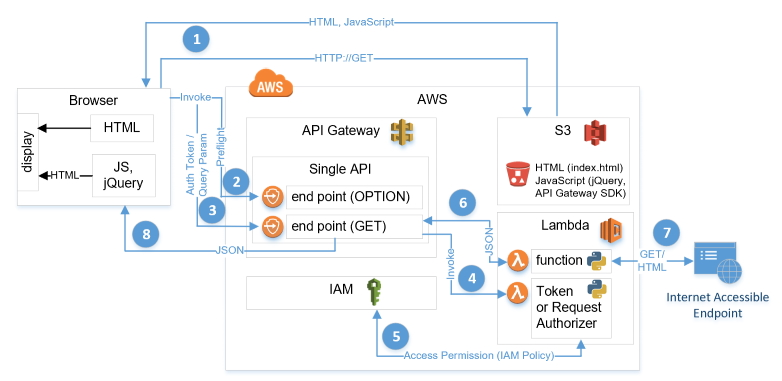

# Dynamic Dashboard
This repository does not contain a bundle of source code that you can simply clone to your machine and bring up a functioning managerial decision support dashboard.  While it does contain some source code and technical guidance, it is intended to serve as a template that you can use to create a solution similar to one that I delivered to a client in need of a decision support dashboard that dynamically sourced up-to-date information.

## Context for Dynamic Dashboard Development
My client was a regional director, in the civil construction business unit, of an international heavy construction company.  Delivery on contracts awarded to his company required intense coordination of not only internal activities but also coordination of external activities and of information (e.g., subcontractors, vendors, suppliers, client).   Upon reaching the limits of his centralized, internal IT department, my client sought my advice.  I developed and demonstrated a Proof of Concept (POC), secured approval to move forward with solution development, and ultimately delivered a fully operational dynamic, decision support dashboard.  Solution development involved working with my client’s local IT staff as well as several entities external to my client’s organization (e.g., subcontractors, vendors, suppliers, client).  After reviewing the results of using the solution on a single project, my client directed his local IT staff to deploy the solution on all high-risk and / or complex projects under his span of control.  While there is some potential for corporate-wide adoption of the solution, the introduction and subsequent adoption of bottom-up IT initiatives is typically an uphill struggle in established, traditional organizations that have centralized IT departments.  Resistance to change, regardless of the merits of said change, often proves to be insurmountable. :)



For obvious reasons, the source code snippets provided in this repository came from the POC; not from the production solution delivered to my client.  However, the POC is feature complete, containing all of the functionality that I ultimately delivered to my client.  It is AWS-based and 100% severless. 

## Solution Components
* Single-Page Web Application
* Backend

NOTE: 
While I do provide source code snippets and technical guidance for implementing this solution, I do not provide background explanations of AWS services.  Simple Internet searches can easily provide this information.  The target audience for this repository is experienced AWS solution architects.


### Single-Page Web Application
#### Application Overview
The twelve files located in https://github.com/JayeHicks/DynamicDashboard/web-app constitute  the POC’s single-page web application.  All 12 files are hosted in an S3 bucket configured for static web hosting.  

A quick study of the index.html will reveal that html button pushes result in invoking AWS-hosted Internet accessible endpoints.  Invoking such an endpoint (i.e., AWS API Gateway API) results in the execution of an AWS Lambda function.  The Lambda functions in turn access an Internet accessible endpoint, retrieve data of interest, format the data, and return the formatted data to the end user’s web browser.  More information on the Lambda functions is provided below in the “Data Acquisition” section.   This will serve as a simplified application architecture diagram.

 

NOTE:
The eleven JavaScript files were generated using the API Gateway portion of the AWS Console. To generate these files select an API Gateway API, select “Stages”, select “prod”, select “SDK Generation”, use the drop down selection box to select a platform (e.g., JavaScript), and select “Generate SDK.”  Ten of the eleven files will be identical regardless of which API you decide to use when generating the eleven files.  I modified the unique file, apigClient.js, so that a single set of eleven JavaScript files can facilitate any number of AWS API Gateway APIs.  In order for this modified JavaScript file to work for you, you will need to set an attribute in your single page web application (e.g., index.html).

#### Security
The POC single page web application requires both authentication and authorization before an end user can gain access to any functionality. 
  
Authentication is achieved through Web Identity Federation with Facebook.  In the file index.html you can see the JavaScript functions enabling this federation.  In addition to adding the Facebook federation JavaScript to your single page web application, two preliminary actions are required.  First, you must access the Facebook app development website in order to set up a Facebook app and thereby obtain a Facebook app id.  Second, you must create and configure an AWS Cognito User Identity Pool that trusts users who are logged into Facebook.  While configuring the User Identity Pool, in “Authentication Providers” select the “Facebook” tab so that you can enter the Facebook App ID that was obtained in step one.  Creating a User Identity Pool results in the automatic creation of two roles.  Ensure that you do not delete or modify any of the default permissions provided to either of these roles (e.g., cognito-identity, mobileanalytics, cognito-sync).  For the POC, I added permission to the role defined for “authenticated identities” so that these identities could invoke AWS API Gateway APIs.  Note that  I added permissions to this role; I did not modify or delete preexisting permissions.  Here is an example of an AWS IAM security policy that you can use to get started.  You might want to tighten security of this policy a bit when you deploy to production (i.e., narrow down from ‘*’ if you can).

```
{
    "Version": "2012-10-17",
    "Statement": [
        {
            "Sid": "VisualEditor0",
            "Effect": "Allow",
            "Action": [
                "cognito-identity:*",
                "mobileanalytics:PutEvents",
                "cognito-sync:*"
            ],
            "Resource": "*"
        },
        {
            "Effect": "Allow",
            "Action": [
                "execute-api:Invoke",
                "lambda:*",
                "logs:*"
            ],
            "Resource": "*"
        }
    ]
}
```

You also need to define which Web Identities can assume the AWS IAM Role for the authenticated identities mentioned above.  To do so, create a Trust Relationship in which you define a StringEquals condition for the Cognito Identity Pool ID (NOTE: not the ARN of the Identity Pool but its ID).  To save a wordy textual explanation, here is a picture to help you get the general idea.



The POC’s AWS API Gateway APIs cannot be invoked by the general public.  They are secured by Lambda Authorizer functions that decide whether or not an end user of the web application will be allowed to invoke an API.  This decision is based on the end user’s Facebook User ID.  In the original request from the client browser the end user’s Facebook User ID is passed along as a query string parameter.  Study of index.html will reveal that the Facebook User ID of web application’s end user is captured after successful authentication with Facebook.  For the POC, I elected to use Request Lambda Authorizers vs Token Lambda Authorizers.  A single Request Lambda Authorizer is used to secure all of the API Gateway APIs.  In summary, the POC employs a “white listing” strategy to grant access to the web application’s functions to a select number of named individuals whose Facebook User IDs are known by the Lambda Authorizer.

To set up Lambda Authorizers for your API Gateway APIs first create your Lambda Authorizer function.  Then, for each API, in the API Gateway section of the AWS Console select “Authorizers”, select “Create New Authorizer”, and fill out the required information which involves selecting the Lambda Authorizer that you previously created.  When modifying API Gateway APIs don’t forget to promote your changes to ‘prod.’ 

Here is a genericized template that you can use to get started building your Lambda Authorizer.  In this template a request is “authorized” only if the client-supplied HeaderAuth1 header, QueryString1 query parameter, stage variable of StageVar1, and the accountId in the request context all match the specified values of 'headerValue1', 'queryValue1', 'stageValue1', and '123456789012', respectively.  While this example demonstrates three different mechanisms, for authorization in the POC I only used a single query string parameter.


```
exports.handler = function(event, context, callback) {        
    console.log('Received event:', JSON.stringify(event, null, 2));

    // Retrieve request parameters from the Lambda function input:
    var headers = event.headers;
    var queryStringParameters = event.queryStringParameters;
    var pathParameters = event.pathParameters;
    var stageVariables = event.stageVariables;
    var requestContext = event.requestContext;
        
    // Parse the input for the parameter values
    var tmp = event.methodArn.split(':');
    var apiGatewayArnTmp = tmp[5].split('/');
    var awsAccountId = tmp[4];
    var region = tmp[3];
    var restApiId = apiGatewayArnTmp[0];
    var stage = apiGatewayArnTmp[1];
    var method = apiGatewayArnTmp[2];
    var resource = '/'; // root resource
    if (apiGatewayArnTmp[3]) {
        resource += apiGatewayArnTmp[3];
    }
        
    // Perform authorization to return the Allow policy for correct parameters and 
    // the 'Unauthorized' error, otherwise.
    var authResponse = {};
    var condition = {};
    condition.IpAddress = {};
     
    if (headers.HeaderAuth1 === "headerValue1"
        && queryStringParameters.QueryString1 === "queryValue1"
        && stageVariables.StageVar1 === "stageValue1"
        && requestContext.accountId === "123456789012") {
        callback(null, generateAllow('me', event.methodArn));
    }  else {
        callback("Unauthorized");
    }
}
     
// Help function to generate an IAM policy
var generatePolicy = function(principalId, effect, resource) {
    // Required output:
    var authResponse = {};
    authResponse.principalId = principalId;
    if (effect && resource) {
        var policyDocument = {};
        policyDocument.Version = '2012-10-17'; // default version
        policyDocument.Statement = [];
        var statementOne = {};
        statementOne.Action = 'execute-api:Invoke'; // default action
        statementOne.Effect = effect;
        statementOne.Resource = resource;
        policyDocument.Statement[0] = statementOne;
        authResponse.policyDocument = policyDocument;
    }
    // Optional output with custom properties of the String, Number or Boolean type.
    authResponse.context = {
        "stringKey": "stringval",
        "numberKey": 123,
        "booleanKey": true
    };
    return authResponse;
}
     
var generateAllow = function(principalId, resource) {
    return generatePolicy(principalId, 'Allow', resource);
}
     
var generateDeny = function(principalId, resource) {
    return generatePolicy(principalId, 'Deny', resource);
}

```

An application architecture diagram depicting the flow of execution (starting with end user log on through to successful access of application functionality) is presented below, but broken up into two diagrams.  A single diagram would have involved an overwhelming amount of detail.  The first diagram illustrates the general flow from end user logon through to attempting to invoke application functionality.  Authorization is required to invoke the application’s functionality and this authorization flow is depicted in the second diagram.  If you want to conceptually integrate the two diagrams, step 8 from the first diagram roughly translates picks up in step 4 of the second diagram. 


High Level Flow (without detail of Lambda Authorizers)



High Level Flow of Lambda Authorizers


### Backend
#### Overview
I designed the POC such that a single API Gateway API is dedicated to acquiring a particular type of information (i.e., live music performance schedule for a given venue).  There is a one-to-one relationship between API Gateway APIs and data collection Lambda functions.  Two query string parameters are passed to an API Gateway API, and subsequently a Lambda function, each time the end user makes a request via the single page web application.  One query string parameter is used by the Lambda Request Authorizer (i.e., Facebook User ID) and the other is used inside of the data collection Lambda function to refine the collected information before it is presented back to the end user (i.e., a venue’s live music performance schedule for a given day of the week).  

Creating API Gateway APIs that invoke Lambda functions is fairly straightforward as is creating Lambda functions that are triggered by API Gateway APIs.  A considerable amount of on-line documentation exists to help you with either task.
 
#### Data Acquisition
For the POC, I wrote python scripts that access Internet accessible endpoints, retrieve information, format the information, and return the formatted information back to the end user.  You can see the scripts used in the POC, and still in use today, at https://github.com/JayeHicks/DynamicDashboard/data-collection.  At this time, one of the original endpoints (i.e., in use since 2018) has changed format and I have yet to decide whether or not to employ a headless browser in order to secure the desired information.  While I would enjoy the challenge, it really just comes down to finding the free time. 

#### Security
The data collection Lambda functions can only be invoked by the API Gateway APIs.  Lambda Authorizers determine which single page web application end users can invoke an API Gateway API.  I kept things simple in the POC; a white list of Facebook User IDs is maintained in the Lambda Authorizer.

## Final Thoughts
Web Identity Federation with Facebook frees you from having to manage user ids and passwords, but it does come at a price.  With the initial deployment of the POC, Facebook allowed my Facebook App to have an “http” URL.  This changed over time and I was forced into changing to an “https” URL for my web application.  Since I wanted to continue hosting my application in an S3 bucket configured for static web hosting, I wound up creating an AWS CloudFront distribution for my web application that did nothing more than provide an “https” URL (i.e., offload https traffic and route http traffic to my S3 bucket).  While this took all of 5 minutes, its annoying to mess with something that is already working and to have to add another technical component to a solution; not to mention having to roll out a new URL to all of my friends who have become addicted to my Live Music Calendar application.  Additionally, be aware that Facebook monitors all of its registered Facebook Apps.  My guess is that they do not want name brand association with applications that would reflect poorly upon them (e.g., non functioning applications or applications with broken links).  I suspect that Facebook employs bots to crawl all of their registered Facebook Apps in order to catch certain issues and send out automated emails.  When one of the Internet accessible endpoints that my POC was scraping changed formats,  I got an automated email from Facebook.  Out of curiosity, I responded to the email and from that point forward I began trading email with an actual human.  It turned out to be different people for each response but the responses were definitely from humans.  The fix was easy, but it is worth noting that Facebook will expend time and energy keeping tabs on your application if you use Facebook Web Identity Federation.  

## License
This project is licensed under the GNU Public License v3.0.  For details see: https://github.com/JayeHicks/DynamicDashboard/blob/master/LICENSE
